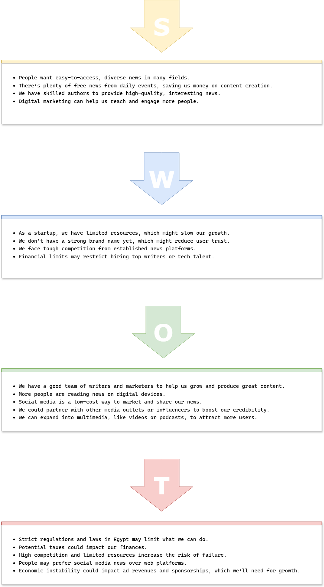
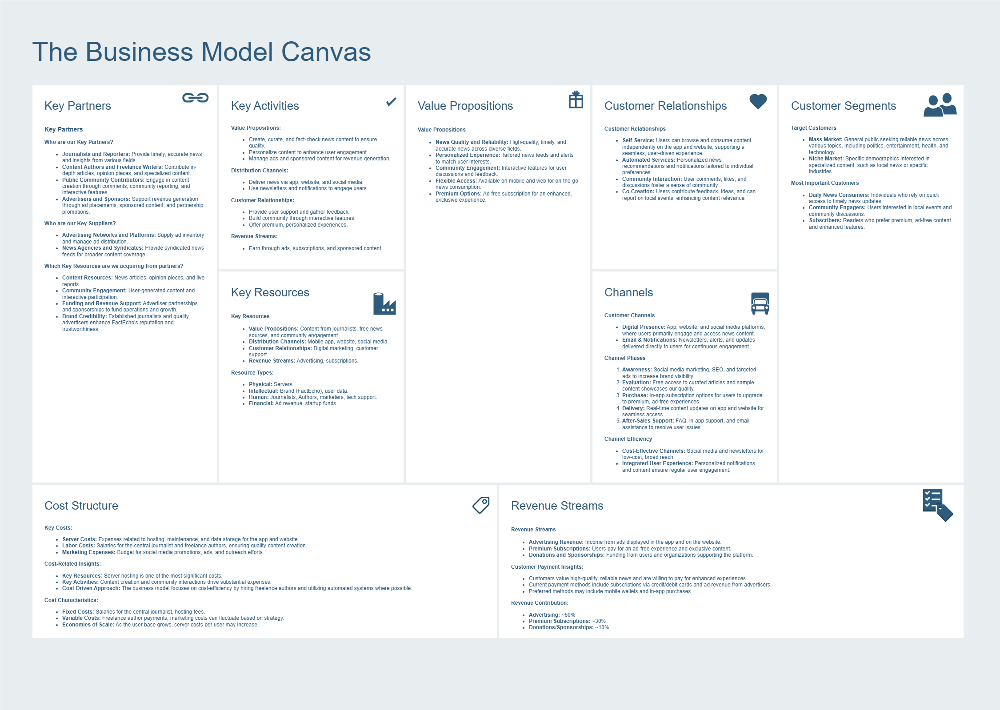
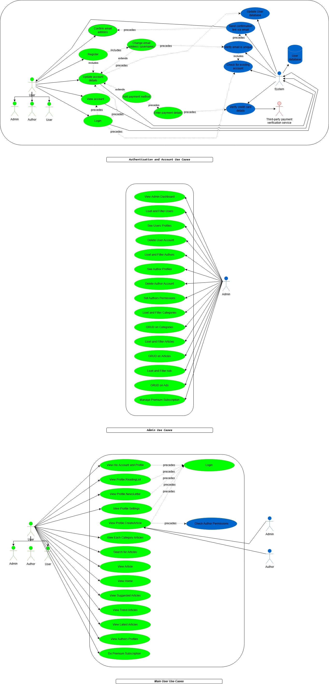
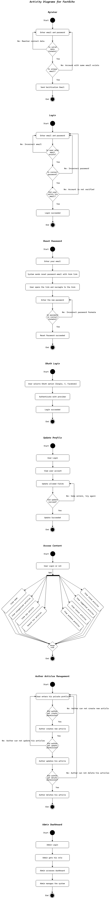

# FactEcho Product Requirements Document (PRD)

## **Table of Contents**
- [Overview](#overview)
- [Features and Experience](#features-and-experience)
- [SWOT Analysis](#swot-analysis)
- [Business Model](#business-model)
- [Use Case Diagram](#use-case-diagram)
- [Activity Diagram](#activity-diagram)
- [Technologies Used](#technologies-used)
- [Clients](#clients)
- [Hosting](#hosting)

## **Overview**
FactEcho is a news application that provides users with up-to-date news across various fields, emphasizing truth, transparency. Initially, FactEcho will be available as a website, with a mobile app and community engagement planned for future versions.

## **Features and Experience**

### Authentication and Authorization
  - **User Registration:** Users can register using their name, unique email and password, followed by email verification.
  - **Login:** Users can log in with their email and password.
  - **Password Reset:** Users can reset their password through a secure method.
  - **Security:** Passwords will be encrypted, and JWT will be implemented for secure authentication.
  - **OAuth:** User can login by OAuth (Google and Facebook).

### User Profile and Settings
  - **Profile Management:** Users can update their profile information, including username, password and profile picture.
  - **Account Deletion:** Options for users to delete their accounts if desired.
  - **Multi Roles:** Roles for admins, authors and users.
  - **Author Public Profile:** Users can see author articles and its profile.

### News Categories
  - **Categorized News:** A dedicated section for various news categories (e.g., politics, sports, technology).

### News Articles
  - **Various Articles:** Light size articles contains images and embedded media frames.
  - **Article Search:** Users can search for news articles and access individual article pages.
  - **Article Page:** Page for each article.
  - **Article Quires:** Suggested random article, trend articles, latest articles.
  - **Interactions with Article:** In the future, Users maybe can like, save and comment on articles, we can allow users to follow specific authors, Also we can allow users to add their articles too.

### Admin Dashboard
  - **Users Permissions Controls:** Set users as authors and set authors Permissions.
  - **Categories Controls:** Admin can create, update and delete various categories.
  - **Articles Controls:** Admin can create, update and delete various Articles.
  - **Ads Controls:** In the future, Admin can create ads for a specific places in the app like some ads in slider in home and categories pages another ads slider in articles and search pages.
  - **Email News Letter:** In the future, we can allow admin to send news letter to users who subscribe in this service.
  - **Statistics View:** In the future, we can add statistics for admin about the system.

### Author Dashboard
  - **Author Articles:** Author can create, update and delete its articles depending on his permissions.

### Premium Features
  - **Subscription Options:** In the future, Future plans to offer premium subscriptions for an ad-free experience and exclusive content.

### Installation
  - In the future, Instructions on how to set up and run the application.

### Usage
  - In the future, Guidelines on how to use the app effectively.

### Contributing
  - In the future, Information on how to contribute to the project.

### License
  - In the future, Details about the project license.

## **SWOT Analysis**

<section align="center">
  
</section>

## **Business Model**

<section align="center">
  
</section>

## **Use Case Diagram**

<section align="center">
  
</section>

## **Activity Diagram**

<section align="center">
  
</section>

## **Technologies Used**

- **Analysis and design**: draw.io, docs
- **Frontend**: HTML, CSS, TypeScript, React.js, Tailwind CSS
- **Backend**: Node.js, TypeScript, Express.js
- **Testing**: Jest, Swagger
- **Database**: PostgreSQL
- **Media Storage**: Cloudinary
- **Authentication**: JWT (JSON Web Tokens)

## **Clients**

we'll start with a single web client..

The web client will be implemented in React.js.

I should upgrade React.js client to Next.js to satisfy SEO.

The App will take design like https://www.ajnet.me/ and https://www.bbc.com/arabic.

See design snapshots here [./UI.Snapshots.md](./UI.Snapshots.md).

API server will serve a static bundle of the React app.

Uses Tailwind CSS UI for building the CSS components.

## **Hosting**

The code will be hosted on Github.

The web server and client will be hosted on vercel platform as a test prototype.

The server should be hosted at paid VIM.

The client should have a domain name and SSL/TLS.

The server will have closed CORS policy except for the domain name and the web host server.
