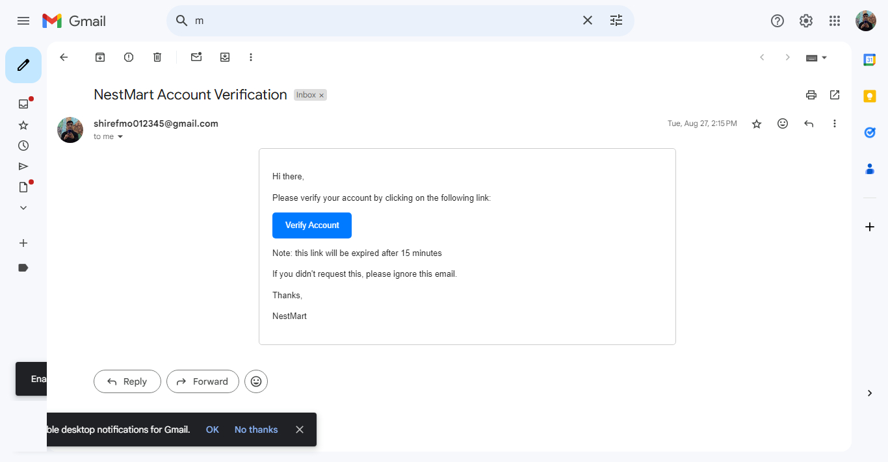

# FactEcho UI Pages Design

## **Table of Contents**
- [Authentication](#authentication)
  - [Register](#register)
  - [Login](#login)
  - [Reset Password](#reset-password)
  - [Change Password](#change-password)
  - [Verify Password Email](#verify-password-email)
  - [Reset Password Email](#reset-password-email)
- [User Profile](#user-profile)
  - [Account](#account)
  - [Reading List](#reading-list)
  - [News Letters](#news-letters)
  - [Settings](#settings)
- [Author Profile](#author-profile)
  - [Public Profile](#public-profile)
  - [Create Article](#create-article)
- [Articles](#articles)
  - [Categories](#categories)
  - [Search](#search)
  - [Article](#article)
- [Main](#main)
  - [Home](#home)
  - [Suggested Articles](#suggested-articles)
  - [Trend Articles](#trend-articles)
  - [Latest Articles](#latest-articles)
- [Admin](#admin)
  - [Dashboard](#dashboard)
  - [Users](#users)
  - [Authors and Their Permissions](#authors-and-their-permissions)
  - [Categories](#categories-1)
  - [Create and Update Category](#create-and-update-category)
  - [Articles](#articles-1)
  - [Create and Update Article](#create-and-update-article)
  - [Ads Management](#ads-management)
  - [Premium Subscriptions Management](#premium-subscriptions-management)

## **Authentication**

### Register

### Login

### Reset Password

### Change Password

### Verify Password Email

### Reset Password Email

## **User Profile**

### Account

### Reading List

### News Letters

### Settings

## **Author Profile**

### Public Profile

### Create Article

## **Articles**

### Categories

### Search

### Article

## **Main**

### Home

### Suggested Articles

### Trend Articles

### Latest Articles

## **Admin**

### Dashboard

### Users

### Authors and Their Permissions

### Categories

### Create and Update Category

### Articles

### Create and Update Article

### Ads Management

### Premium Subscriptions Management

